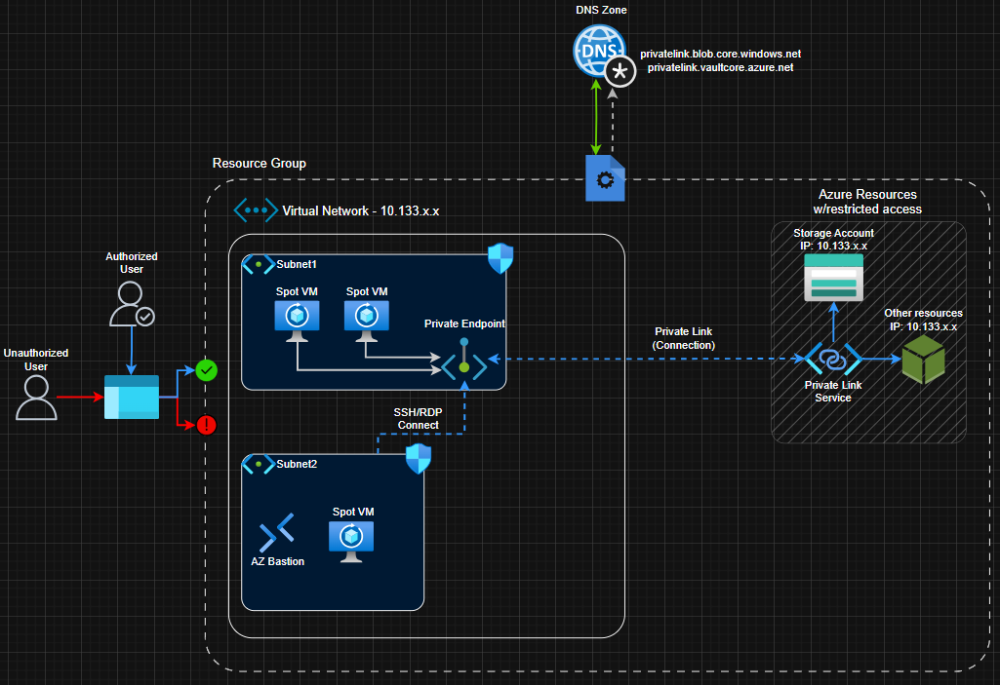

# Private Endpoint Module

Private Endpoint is the main component you attach to your already existing virtual network and subnets to allow secure traffic to access your resources in the cloud. 
We connect the private endpoint to a resource like for example a storage account via a Private Link Service. 
This enables a direct connection via the Private Endpoint to the Private Link Service and routes the traffic through Azure's Backbone and never exposes it to the internet.

In the image below, you can see an example on how Private Endpoints are visually connected to other resources.



## General Example module

```hcl
module "storage_private_endpoint" {
  source = "./terraform-azurerm-private-endpoint"

  resource_name                 = "your-storage-account-name"
  resource_id                   = azurerm_storage_account.your_resource.id
  resource_group_name           = "your-resource-group"
  resource_group_location       = "your-azure-location"
  subresource_name              = "blob"  # Determines the Azure service type to connect to
  private_endpoint_subnet_id    = azurerm_subnet.your_pe_subnet.id
  
  # Note: private_dns_zone_id is accepted but not currently used by the module
  # DNS integration must be configured separately
  private_dns_zone_id           = azurerm_private_dns_zone.your_dns_zone.id
}
```

## Prerequisites

### 1. Subnet Configuration
```hcl
resource "azurerm_subnet" "private_endpoints" {
  name                              = "private-endpoints"
  # ... other configuration ...
  private_endpoint_network_policies = "Disabled"
}
```
**Purpose**: Private endpoints require network policies to be disabled on the subnet to function properly. This setting allows private endpoint traffic to bypass Network Security Group (NSG) rules and User Defined Routes (UDRs), ensuring reliable connectivity to Azure PaaS services.

### 2. Private DNS Zone (Recommended for Manual Configuration)
It is recommended to configure a Private DNS Zone
```hcl
resource "azurerm_private_dns_zone" "storage" {
  name                  = "privatelink.blob.core.windows.net"
  resource_group_name   = "your-resource-group"
}

resource "azurerm_private_dns_zone_virtual_network_link" "storage" {
  name                      = "storage-dns-link"
  resource_group_name       = azurerm_resource_group.main.name
  private_dns_zone_name     = azurerm_private_dns_zone.storage.name
  virtual_network_id        = azurerm_virtual_network.main.id
}
```
**Purpose**: Private DNS zones enable automatic name resolution for private endpoints, allowing your applications to use the same connection strings as public endpoints while routing traffic privately. **Note**: This module currently accepts `private_dns_zone_id` as input but doesn't automatically configure DNS integration - you must set up DNS zones and links manually as shown above.

### 3. Target Resource with Disabled Public Access
```terraform
resource "azurerm_storage_account" "example" {
  name                            = "your-storage-account"
  public_network_access_enabled   = false  # Security best practice
  # ... other configuration
}
```
**Purpose**: Disabling public network access ensures that the Azure service can only be accessed through private endpoints, eliminating any potential for internet-based attacks. This creates a true private-only configuration where all traffic flows through your VNet using Azure's backbone network.

## Common Examples

### Storage Account
```hcl
module "storage_pe" {
  source = "./azurerm-private-endpoint"

  resource_name                 = "your-storage-account-name"
  resource_id                   = azurerm_storage_account.your_storage.id
  resource_group_name           = "your-resource-group"
  resource_group_location       = "your-azure-region"
  subresource_name              = "blob"
  private_endpoint_subnet_id    = azurerm_subnet.your_pe_subnet.id
  private_dns_zone_id           = azurerm_private_dns_zone.your_blob_dns.id
}
```

### Key Vault
```hcl
module "keyvault_pe" {
  source = "./azurerm-private-endpoint"

  resource_name                 = "your-keyvault-name"
  resource_id                   = azurerm_key_vault.your_keyvault.id
  resource_group_name           = "your-resource-group"
  resource_group_location       = "your-azure-region"
  subresource_name              = "vault"
  private_endpoint_subnet_id    = azurerm_subnet.your_pe_subnet.id
  private_dns_zone_id           = azurerm_private_dns_zone.your_kv_dns.id
}
```

## Common Subresource Names

The table below shows the relationship between Azure services, their subresource names, and the corresponding private DNS zones. **Your module uses the subresource name to configure the private endpoint connection**, while the DNS zones must be created and configured separately.

| Service | Subresource (for module input) | DNS Zone (create separately) |
|---------|-------------|----------|
| Storage (Blob) | `blob` | `privatelink.blob.core.windows.net` |
| Storage (File) | `file` | `privatelink.file.core.windows.net` |
| Key Vault | `vault` | `privatelink.vaultcore.azure.net` |
| SQL Database | `sqlServer` | `privatelink.database.windows.net` |
| Cosmos DB | `Sql` | `privatelink.documents.azure.com` |
| App Service | `sites` | `privatelink.azurewebsites.net` |

**How to use this table:**
1. **Choose your service** (e.g., Storage Account)
2. **Pass the subresource name** to the module (e.g., `subresource_name = "blob"`)
3. **Create the DNS zone separately** using the DNS zone name (e.g., `privatelink.blob.core.windows.net`)
4. **Link the DNS zone to your VNet** for automatic name resolution

*For complete list: [Azure Private Link Documentation](https://learn.microsoft.com/en-us/azure/private-link/private-endpoint-overview#private-link-resource)*

## Module Inputs

| Name | Description | Type | Required |
|------|-------------|------|----------|
| resource_name | Name of the target resource | `string` | Yes |
| resource_id | ID of the target resource | `string` | Yes |
| resource_group_name | Resource group name | `string` | Yes |
| resource_group_location | Azure region | `string` | Yes |
| subresource_name | Subresource name - validates against: blob, queue, table, file, sql, cosmosdb, keyvault, redis | `string` | No (default: "blob") |
| private_endpoint_subnet_id | Subnet ID for private endpoint | `string` | Yes |
| private_dns_zone_id | Private DNS zone ID (accepted but not used in current implementation) | `string` | No |
| tags | Resource tags | `map(string)` | No |

## Module Outputs

| Name | Description |
|------|-------------|
| private_endpoint_id | Private endpoint resource ID |
| private_endpoint_name | Private endpoint name |
| private_ip_address | Private IP address assigned |
| network_interface_id | Network interface ID |

## Important Notes

### What This Module Does:
- ✅ **Creates private endpoint** using the specified subresource name
- ✅ **Validates subresource names** against common Azure service types
- ✅ **Generates consistent naming** using resource name and subresource
- ✅ **Applies tags** with descriptive metadata

### What This Module Doesn't Do (Manual Setup Required):
- ❌ **DNS Zone Creation**: You must create private DNS zones separately
- ❌ **DNS Integration**: DNS zone linking must be configured manually
- ❌ **VNet Linking**: Private DNS zone to VNet links are not automated

### Setup Requirements:
- **Subnet Requirements**: Must have `private_endpoint_network_policies = "Disabled"`
- **DNS Integration**: Create and link private DNS zones to VNets manually for proper name resolution
- **Security**: Disable public access on target resources when using private endpoints
- **Testing**: Use `nslookup` from VMs to verify DNS resolution returns private IPs

## Requirements

- Terraform >= 1.0
- AzureRM Provider ~> 3.0

